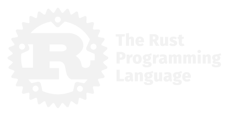

# gguf-rs-cli

<p align="center">
  
</p>

Pure Rust local LLM inference engine with Vulkan GPU acceleration — built entirely from scratch.

Run GGUF models locally in your terminal. No Python, no PyTorch, no CUDA required. Just Rust + Vulkan.

## Features

- **From-scratch inference** — no external ML frameworks, every operation hand-written
- **Vulkan GPU acceleration** — works on NVIDIA, AMD, and Intel GPUs
- **CPU fallback** — runs without a GPU (slower, but works everywhere)
- **Multi-architecture support** — Llama 2, Llama 3/3.1, Mistral, Qwen 1/1.5/2/2.5, Gemma, Phi-3
- **Quantization support** — Q4_0, Q4_K, Q6_K, Q8_0 on GPU; all GGUF types on CPU
- **Smart context** — automatic sliding window so long conversations never cut off
- **Interactive chat** — multi-turn conversations with proper chat templates
- **Single-shot mode** — pipe prompts for scripting
- **100% offline** — no network, no telemetry, no cloud

## Quick Start

```bash
# Build (requires Rust toolchain + Vulkan SDK)
cargo build --release

# Run with GPU
./target/release/gguf-rs-cli --model path/to/model.gguf --gpu

# Run on CPU only
./target/release/gguf-rs-cli --model path/to/model.gguf
```

## Requirements

- **Rust** 1.70+ (install from [rustup.rs](https://rustup.rs))
- **Vulkan SDK** (for GPU acceleration and shader compilation)
  - Download from [lunarg.com/vulkan-sdk](https://vulkan.lunarg.com/sdk/home)
  - GPU mode requires a Vulkan-capable GPU with up-to-date drivers
- **No GPU required** — CPU-only mode works without Vulkan SDK at runtime

## Supported Models

Any GGUF model using these architectures works out of the box:

| Architecture | Models | Chat Template |
|---|---|---|
| `llama` | Llama 2, Llama 3, Llama 3.1, Mistral 7B, CodeLlama | Llama2 / Llama3 |
| `qwen2` | Qwen 2, Qwen 2.5 | ChatML |
| `qwen` | Qwen 1, Qwen 1.5 | ChatML |
| `gemma` | Gemma, Gemma 2 | Gemma |
| `phi3` | Phi-3, Phi-3.5 | Phi3 |

Download models from [Hugging Face](https://huggingface.co/models?search=gguf) in GGUF format.

Recommended starter models:
- [Qwen2.5-7B-Instruct-Q4_K_M](https://huggingface.co/Qwen/Qwen2.5-7B-Instruct-GGUF)
- [Llama-3.1-8B-Instruct-Q4_K_M](https://huggingface.co/bartowski/Meta-Llama-3.1-8B-Instruct-GGUF)
- [Mistral-7B-Instruct-Q4_K_M](https://huggingface.co/TheBloke/Mistral-7B-Instruct-v0.2-GGUF)

## CLI Options

```
Usage: gguf-rs-cli [OPTIONS] --model <MODEL>

Options:
  -m, --model <MODEL>          Path to GGUF model file
  -p, --prompt <PROMPT>        Single prompt (non-interactive mode)
  -s, --system <SYSTEM>        Custom system prompt
  -n, --max-tokens <N>         Max tokens to generate [default: 512]
  -t, --temperature <T>        Sampling temperature [default: 0.7]
      --top-k <K>              Top-K sampling [default: 40]
      --top-p <P>              Top-P (nucleus) sampling [default: 0.9]
      --rep-penalty <P>        Repetition penalty [default: 1.1]
  -c, --ctx-len <N>            Context window size [default: 8192]
      --gpu                    Enable Vulkan GPU acceleration
      --smart-context          Auto-rebuild context when window fills up
      --stats                  Print throughput statistics
      --debug-tokens           Show tokenization details
      --debug-gpu              Show per-token GPU timing breakdown
      --seed <N>               RNG seed [default: 42]
  -h, --help                   Print help
```

## Examples

### Interactive Chat
```bash
gguf-rs-cli --model qwen2.5-7b-instruct-q4_k_m.gguf --gpu --stats
```

### Single Prompt
```bash
gguf-rs-cli --model model.gguf --gpu --prompt "Explain quantum computing in one paragraph"
```

### Custom Settings
```bash
gguf-rs-cli --model model.gguf --gpu \
  --ctx-len 32000 \
  --temperature 0.5 \
  --top-k 50 \
  --max-tokens 1024 \
  --smart-context \
  --system "You are a coding assistant. Be concise."
```

### CPU-Only Mode
```bash
gguf-rs-cli --model model.gguf --stats
```

## Performance

Benchmarked on NVIDIA RTX 3080 (12GB) with Qwen2.5-7B-Instruct Q4_K_M:

| Mode | Speed | Notes |
|---|---|---|
| GPU (Vulkan) | 12-20 tok/s | Depends on GPU power state |
| CPU (Rayon) | ~2-3 tok/s | Multi-threaded |

GPU speed depends on your GPU's power state. For best NVIDIA performance:
```bash
# Optional: lock GPU clocks high (requires admin)
nvidia-smi -lgc 1500,1950
# Run inference
gguf-rs-cli --model model.gguf --gpu --stats
# Reset clocks when done
nvidia-smi -rgc
```

## Architecture

```
src/
├── main.rs              # CLI, chat loop, context management
├── sampler.rs           # Temperature, top-k, top-p, repetition penalty
├── gguf/
│   ├── reader.rs        # GGUF file parser
│   └── types.rs         # GGUF value types, GgmlType enum
├── tensor/
│   ├── dequant.rs       # Quantized tensor dequantization (Q4_0, Q4_K, etc.)
│   └── storage.rs       # Memory-mapped tensor storage
├── model/
│   ├── config.rs        # Model config from GGUF metadata
│   └── llama.rs         # Transformer forward pass (CPU + GPU)
├── math/
│   ├── ops.rs           # RMSNorm, softmax, SiLU, vector add
│   └── rope.rs          # Rotary Position Embeddings
├── tokenizer/
│   ├── bpe.rs           # BPE tokenizer (Llama + GPT-2 style)
│   └── chat.rs          # Chat template detection and formatting
├── gpu/
│   ├── mod.rs           # Vulkan context, pipelines, command recording
│   ├── q4k_gemv.glsl    # Q4_K matrix-vector multiply shader
│   ├── q4_0_gemv.glsl   # Q4_0 matrix-vector multiply shader
│   ├── q6k_gemv.glsl    # Q6_K matrix-vector multiply shader
│   ├── q8_0_gemv.glsl   # Q8_0 matrix-vector multiply shader
│   ├── f32_gemv.glsl    # F32 matrix-vector multiply shader
│   ├── rmsnorm.glsl     # RMS normalization shader
│   ├── attention.glsl   # Multi-head attention shader
│   ├── rope.glsl        # RoPE shader
│   ├── kv_write.glsl    # KV cache write shader
│   ├── swiglu.glsl      # SwiGLU activation shader
│   ├── add.glsl         # Vector addition shader
│   └── add_rmsnorm.glsl # Fused add + RMSNorm shader
└── build.rs             # GLSL → SPIR-V shader compilation
```

## Building from Source

```bash
# 1. Install Rust
curl --proto '=https' --tlsv1.2 -sSf https://sh.rustup.rs | sh

# 2. Install Vulkan SDK from https://vulkan.lunarg.com/sdk/home

# 3. Clone and build
git clone https://github.com/smoffyy/gguf-rs-cli.git
cd gguf-rs-cli
cargo build --release

# 4. Binary is at target/release/gguf-rs-cli (or .exe on Windows)
```

## License

MIT